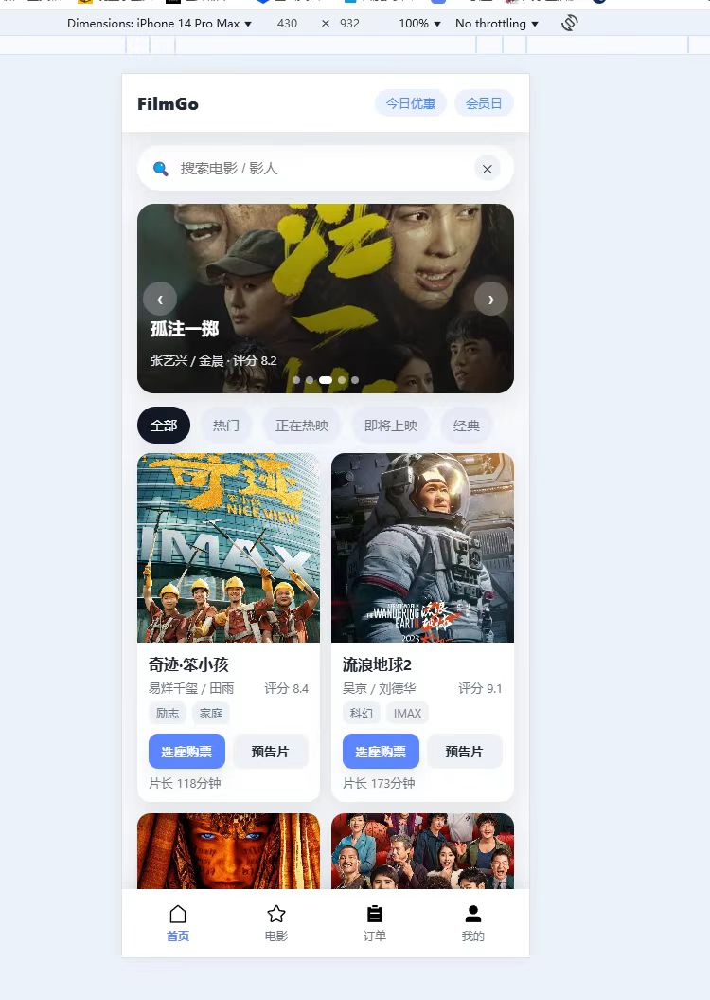

# 🎬 移动端电影购票系统首页设计（HTML5 期末作业）

## 📌 项目简介
本项目为 HTML5 课程期末作业，设计并实现一个 **移动端电影购票系统首页界面**。  
页面以电影信息展示与购票引导为核心，面向移动端用户，采用纯前端技术实现，无需后端与数据库支持，适用于影院宣传、电影票务平台或影视资讯类应用场景。

---

## 🛠 技术实现

- HTML5：页面结构与语义化布局

- CSS3：响应式布局、动画效果、视觉样式

- JavaScript：页面交互逻辑与动态效果

- 开发模式：纯前端实现，无后端与数据库依赖

---
## 📱 运行方式

- 下载或克隆本项目

- 使用浏览器直接打开 index.html

- 建议使用移动端设备或浏览器开发者工具的移动端模式查看效果

## 📌 说明

本项目为课程设计作品，仅用于学习与展示 HTML5 移动端前端页面设计相关技术，不涉及真实购票、支付或后台数据处理。